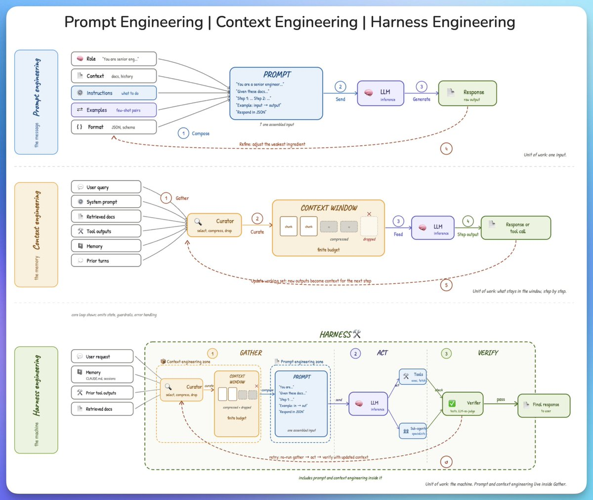

# Prompt vs Context vs Harness Engineering

## TL;DR
Three nested levels of control over an LLM, each a bigger unit of work than the
last. **Prompt engineering** shapes one input. **Context engineering** manages
what stays in the window across steps. **Harness engineering** wraps the whole
gather → act → verify loop — and contains the other two inside it.

## The three levels

### 1. Prompt engineering — *the message* (unit of work: one input)
Compose a single best input from five ingredients, send it, get a response,
then refine the weakest ingredient and repeat.
- **Role** — "You are a senior engineer…"
- **Context** — docs, history
- **Instructions** — what to do
- **Examples** — few-shot pairs
- **Format** — JSON / schema
- Loop: `compose → send → generate → refine the weakest ingredient`.

### 2. Context engineering — *the memory* (unit of work: what stays in the window, step by step)
You have a **finite context budget**. A *curator* selects, compresses, and drops
material so only what matters reaches the model each step.
- Inputs to curate: user query, system prompt, retrieved docs, tool outputs,
  memory, prior turns.
- Flow: `gather → curate (select/compress/drop) → feed → inference → step output`.
- After each step, **update the working set**: new outputs become context for the
  next step. (Core loop only — omits state, guardrails, error handling.)

### 3. Harness engineering — *the machine* (unit of work: the whole loop)
The harness is the outer machine with three zones; prompt and context engineering
**live inside its Gather step**.
- **① GATHER** — context-engineering zone: curator + context window (compressed +
  dropped, finite budget). Sources: user request, memory (CLAUDE.md, sessions),
  prior tool outputs, retrieved docs.
- **② ACT** — prompt-engineering zone: assemble one prompt → LLM inference → branch
  to **Tools** (exec, fetch) or **Sub-agents** (specialists).
- **③ VERIFY** — a verifier (tests, LLM-as-judge) checks the result. On pass →
  final response. On fail → **retry: re-run gather → act → verify with updated context.**

## Why it matters / how I'd apply it
This is the clearest mental model for *where a problem lives* when an agent
misbehaves. Bad single answer → fix the **prompt**. Model forgetting / drowning in
irrelevant tokens → fix **context** (the curator). Agent does the right thing once
but can't recover, loop, or self-check → fix the **harness** (verify + retry).
Maps directly onto how Claude Code itself works: CLAUDE.md + session = memory,
the curated context window = gather, tool/subagent calls = act, tests/judges = verify.

## Related
- [`agentic-ai-reference-architecture`](../04-agents-and-tool-use/agentic-ai-reference-architecture.md) — the full system view of the same loop
- [`claude-code-multi-agent-development`](../04-agents-and-tool-use/claude-code-multi-agent-development.md) — sub-agents in the ACT step
- patterns: [`../../patterns/prompts`](../../patterns/prompts)
