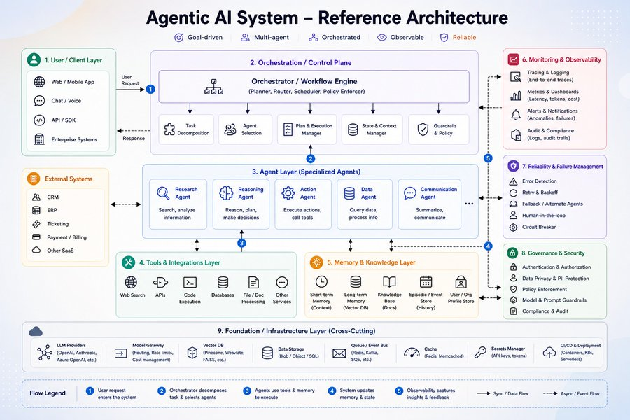

# Agentic AI System — Reference Architecture

## TL;DR
A layered blueprint for a production agentic system. Four core qualities up top —
**goal-driven, multi-agent, orchestrated, observable, reliable** — realized through
nine layers from the user request down to shared infrastructure, with monitoring,
reliability, and governance as cross-cutting concerns on the side.

## The nine layers
1. **User / Client Layer** — entry points: web/mobile, chat/voice, API/SDK, enterprise systems. Sends *user request*, receives *response*.
2. **Orchestration / Control Plane** — the orchestrator / workflow engine (planner, router, scheduler, policy enforcer). Sub-blocks: task decomposition, agent selection, plan & execution manager, state & context manager, guardrails & policy.
3. **Agent Layer (specialized agents)** — research, reasoning, action, data, communication agents. Each owns a narrow job (analyze, plan/decide, execute & call tools, query data, summarize).
4. **Tools & Integrations Layer** — web search, APIs, code execution, databases, file/doc processing, other services.
5. **Memory & Knowledge Layer** — short-term (context), long-term (vector DB), knowledge base (docs), episodic/event store (history), user/org profile store.
6. **Monitoring & Observability** — tracing & logging (end-to-end), metrics & dashboards (latency, tokens, cost), alerts, audit & compliance.
7. **Reliability & Failure Management** — error detection, retry & backoff, fallback / alternate agents, human-in-the-loop, circuit breaker.
8. **Governance & Security** — authn/authz, data privacy & PII protection, policy enforcement, model & prompt guardrails, compliance & audit.
9. **Foundation / Infrastructure (cross-cutting)** — LLM providers, model gateway (routing, rate limits, cost mgmt), vector DB, data storage, queue / event bus, cache, secrets manager, CI/CD & deployment.

## The flow (numbered in the diagram)
1. User request enters the system →
2. Orchestrator decomposes the task & selects agents →
3. Agents use tools & memory to execute →
4. System updates memory & state →
5. Observability captures insights & feedback.

Solid arrows = sync / data flow; dashed = async / event flow.

## Why it matters / how I'd apply it
A checklist for "what am I missing" when designing an agent system. The easy parts
(agents + tools + an orchestrator) are layers 2–5; the parts that make it
*production-grade* are 6–8 (observability, reliability, governance) — exactly the
ones that get skipped in prototypes. Use it to audit any agent build: can I trace a
request end-to-end? Is there a fallback and a circuit breaker? Where do guardrails
and PII protection sit? Layer 9 (model gateway, secrets, cost mgmt) is the shared
infra worth standardizing across products.

## Related
- [`model-context-protocol`](model-context-protocol.md) — standardizes the Tools & Integrations layer (4)
- [`claude-code-multi-agent-development`](claude-code-multi-agent-development.md) — concrete multi-agent patterns for layer 3
- [`prompt-context-harness-engineering`](../01-prompting/prompt-context-harness-engineering.md) — the inner gather→act→verify loop each agent runs
- cross-links: observability/cost → [`../06-infra-cost-latency`](../06-infra-cost-latency), guardrails/PII → [`../07-safety-and-security`](../07-safety-and-security)
