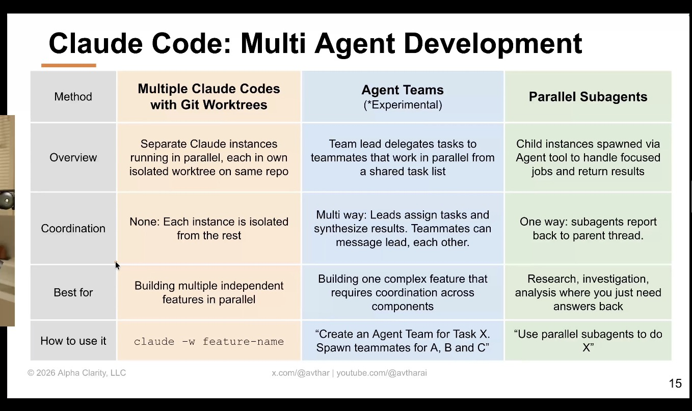
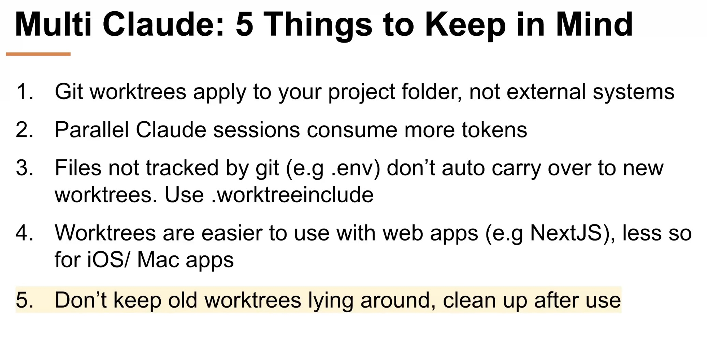

# Claude Code — Multi-Agent Development

> Source: Alpha Clarity, LLC presentation (© 2026), by @avthar
> (x.com/@avthar · youtube.com/@avtharai).

## TL;DR
Three ways to run more than one Claude at once, chosen by how much **coordination**
the work needs: isolated parallel instances (worktrees), a coordinating team
(Agent Teams), or fire-and-forget child agents (parallel subagents).

## The three methods

| | Multiple Claude Codes w/ Git Worktrees | Agent Teams *(experimental)* | Parallel Subagents |
|---|---|---|---|
| **Overview** | Separate Claude instances running in parallel, each in its own isolated worktree on the same repo | A team lead delegates tasks to teammates that work in parallel from a shared task list | Child instances spawned via the Agent tool to handle focused jobs and return results |
| **Coordination** | None — each instance is isolated from the rest | Multi-way — leads assign tasks & synthesize results; teammates can message lead and each other | One-way — subagents report back to the parent thread |
| **Best for** | Building multiple independent features in parallel | Building one complex feature that needs coordination across components | Research, investigation, analysis where you just need answers back |
| **How to use it** | `claude -w feature-name` | "Create an Agent Team for Task X. Spawn teammates for A, B and C" | "Use parallel subagents to do X" |

**Rule of thumb:** more independence → worktrees; more coordination → agent teams;
just need an answer → subagents.

## 5 things to keep in mind (Multi-Claude)

1. **Git worktrees apply to your project folder, not external systems** (DBs, deployed services, etc. are shared).
2. **Parallel Claude sessions consume more tokens.**
3. **Untracked files (e.g. `.env`) don't auto-carry into new worktrees** — use `.worktreeinclude`.
4. **Worktrees are easier with web apps (e.g. Next.js), less so for iOS / Mac apps.**
5. **Don't keep old worktrees lying around — clean up after use.**

## Why it matters / how I'd apply it
A clean decision framework for *when* to parallelize Claude Code work, plus the
operational gotchas that bite in practice. Pick the method by coordination need —
don't reach for an Agent Team when isolated worktrees suffice, and don't burn tokens
on parallel sessions for work that's actually sequential. Watch the worktree
footguns (#3 `.env` and #5 cleanup) — they map onto the harness/isolation behavior
this very knowledge repo runs under.

## Related
- [`agentic-ai-reference-architecture`](agentic-ai-reference-architecture.md) — multi-agent patterns for the Agent Layer (3)
- [`prompt-context-harness-engineering`](../01-prompting/prompt-context-harness-engineering.md) — subagents live in the harness ACT step
- cross-links: harness/SDK specifics → [`../09-tooling-and-sdks`](../09-tooling-and-sdks)
