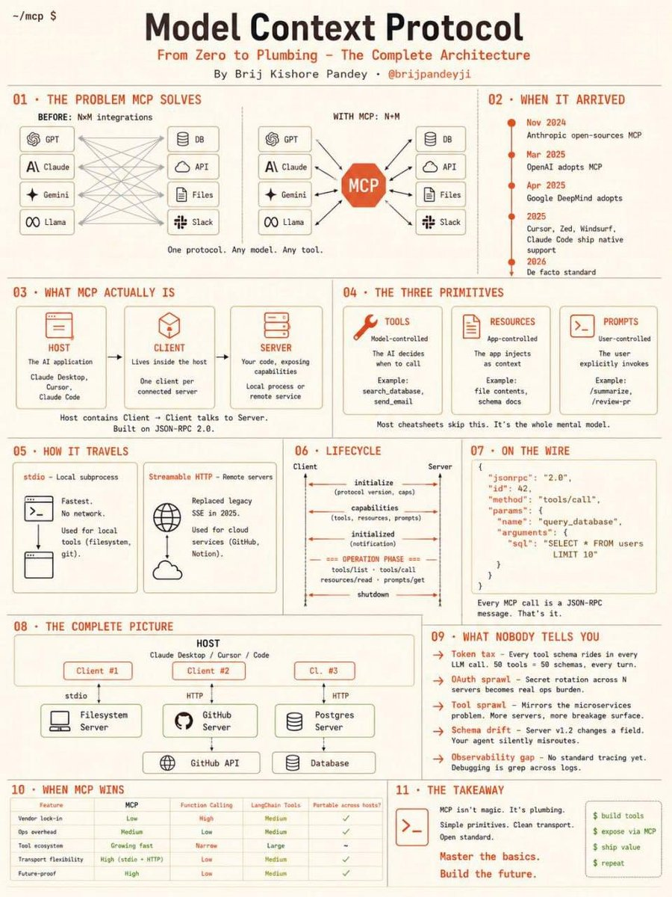

# Model Context Protocol (MCP) — From Zero to Plumbing



> Source: "Model Context Protocol — From Zero to Plumbing, The Complete Architecture"
> by Brij Kishore Pandey (@brijpandeyji).

## TL;DR
MCP is a single open protocol that turns the **N×M** integration problem (every
model wired to every tool) into **N+M** (each model and each tool speaks one
protocol). "One protocol. Any model. Any tool." It isn't magic — it's plumbing:
simple primitives over clean transport on JSON-RPC 2.0.

## The problem it solves
Before MCP, connecting *N* models to *M* tools meant *N×M* bespoke integrations.
With MCP it's *N+M*: each side implements the protocol once.

## Timeline
- **Nov 2024** — Anthropic open-sources MCP
- **Mar 2025** — OpenAI adopts MCP
- **Apr 2025** — Google DeepMind adopts
- **2025** — Cursor, Zed, Windsurf, Claude Code ship native support
- **2026** — de facto standard

## What MCP actually is (three roles)
- **Host** — the AI application (Claude Desktop, Cursor, Claude Code).
- **Client** — lives inside the host; one client per connected server.
- **Server** — your code, exposing capabilities; a local process or remote service.

Host contains Client → Client talks to Server. Built on **JSON-RPC 2.0**.

## The three primitives
- **Tools** — *model-controlled*: the AI decides when to call (e.g. `search_database`, `send_email`).
- **Resources** — *app-controlled*: the app injects them as context (e.g. file contents, schema docs).
- **Prompts** — *user-controlled*: the user explicitly invokes (e.g. `/summarize`, `/review-pr`).

> Most cheatsheets skip this distinction — it's the whole mental model.

## How it travels (transport)
- **stdio** — local subprocess; fastest, no network; for local tools (filesystem, git).
- **Streamable HTTP** — remote servers; replaced legacy SSE in 2025; for cloud services (GitHub, Notion).

## Lifecycle
`initialize` (protocol version, caps) → `capabilities` (tools, resources, prompts)
→ `initialized` (notification) → **operation phase** (`tools/list`, `tools/call`,
`resources/read`, `prompts/get`) → `shutdown`.

## On the wire
Every MCP call is a JSON-RPC message:
```json
{ "jsonrpc": "2.0", "id": 42, "method": "tools/call",
  "params": { "name": "query_database",
              "arguments": { "sql": "SELECT * FROM users LIMIT 10" } } }
```

## What nobody tells you (the gotchas)
- **Token tax** — every tool schema rides in every LLM call. 50 tools = 50 schemas, every turn.
- **OAuth sprawl** — secret rotation across N servers becomes a real ops burden.
- **Tool sprawl** — mirrors the microservices problem: more servers, more breakage surface.
- **Schema drift** — a server v1.2 changes a field and your agent silently misroutes.
- **Observability gap** — no standard tracing yet; debugging is grep across logs.

## When MCP wins (vs function calling / LangChain tools)
Lower vendor lock-in, growing tool ecosystem, high transport flexibility
(stdio + HTTP), and portability across hosts — at the cost of medium ops overhead.

## Why it matters / how I'd apply it
MCP is the standard way to expose tools/data to Claude Code and other hosts, so it's
the default integration layer for anything I build. Practical takeaways: keep the
**tool count lean** (token tax is per-call), pin/version schemas to avoid drift,
plan for **OAuth and secret rotation** early, and add my own tracing since the
protocol gives none. Map this onto the Tools & Integrations layer of the
[agentic reference architecture](agentic-ai-reference-architecture.md).

## Related
- [`agentic-ai-reference-architecture`](agentic-ai-reference-architecture.md) — MCP fills layer 4 (Tools & Integrations)
- [`claude-code-multi-agent-development`](claude-code-multi-agent-development.md) — Claude Code is an MCP host
- cross-links: cost/tokens → [`../06-infra-cost-latency`](../06-infra-cost-latency), secrets/auth → [`../07-safety-and-security`](../07-safety-and-security)
